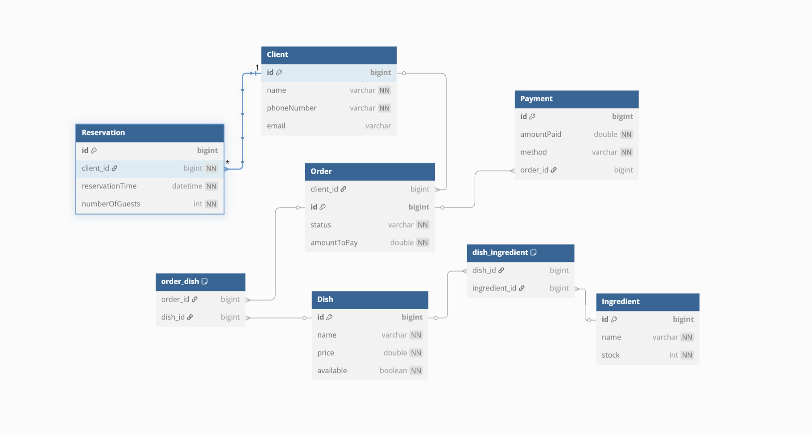

# Restaurant Order Management System

## 📋 Prezentare Proiect

Sistemul de management al comenzilor pentru restaurant implementat cu arhitectură microservices, folosind Spring Cloud și Docker.

#### Business Requirements
1. Adaugare, modificare si stergere de preparate.
2. Preluarea comenzilor si asocierea lor cu clienti.
3. Gestionarea rezervarilor de mese.
4. Procesarea platilor pentru comenzi.
5. Monitorizarea stocului de ingrediente pentru preparate.
6. Generarea de rapoarte privind cele mai comandate preparate.
7. Monitorizarea statusului comenzilor.
8. Istoric al comenzilor per client.
9. Posibilitatea de plati cash sau card.
10. Control asupra disponibilitatii preparatelor in functie de stoc.

#### Entitati si Relatii
* **Entitati:** Client, Order, Dish, Reservation, Ingredient, Payment
* **Relatii:** Order-Client (many-to-one), Order-Payment (one-to-one), Order-Dish (many-to-many), Dish-Ingredient (many-to-many), Client-Reservation (one-to-many)



#### MVP features
1. CRUD pentru meniul de preparate.
2. Gestionarea comenzilor si a rezervarilor.
3. Administrarea stocului de ingrediente.
4. Gestionarea platilor pentru comenzi.
5. Rapoarte privind popularitatea preparatelor.


## 🏗️ Arhitectura Sistemului

### Monolit
- **Locație:** `java-project/`
- **Tehnologii:** Spring Boot, Spring Security, H2 Database, MySQL
- **Port:** 8080

### Microservices
- **Locație:** `microservices/`
- **Tehnologii:** Spring Cloud, Docker, Prometheus, Grafana
- **Servicii:** Config Server, Eureka Server, Gateway Service, User Service, Menu Service

## 🚀 Pornirea Sistemului

### Opțiunea 1: Monolit (Original)
```bash
cd java-project
mvn spring-boot:run
```
**Acces:** http://localhost:8080

### Opțiunea 2: Microservices (Migrat)
```bash
cd microservices
docker-compose up -d --build
```
**Dashboard-uri:**
- Eureka: http://localhost:8761
- Prometheus: http://localhost:9090
- Grafana: http://localhost:3000 (admin/admin)
- Gateway: http://localhost:8080

## 📊 Funcționalități

### Monolit
- Gestionare clienți
- Gestionare meniu și ingrediente
- Gestionare comenzi și plăți
- Gestionare rezervări
- Autentificare și autorizare
- Interfață web (Thymeleaf)

### Microservices
- Configurare centralizată
- Service discovery automat
- Load balancing și scalabilitate
- Monitoring și metrici
- Health checks și reziliență
- API Gateway cu routing
- Comunicare între servicii

## 🏛️ Design Patterns Implementate

### Monolit
- **MVC Pattern** - Controllers, Services, Repositories
- **Repository Pattern** - Data access layer
- **Service Layer Pattern** - Business logic separation

### Microservices
- **API Gateway Pattern** - Single entry point
- **Service Discovery Pattern** - Dynamic service location
- **Configuration Management Pattern** - Centralized config
- **Load Balancer Pattern** - Request distribution
- **Circuit Breaker Pattern** - Fault tolerance
- **Observer Pattern** - Metrics and monitoring

## 📈 Metrici și Monitoring

### Monolit
- Basic health checks
- Application logs

### Microservices
- **Prometheus** - Metrics collection
- **Grafana** - Metrics visualization
- **Actuator** - Health checks and metrics
- **Custom metrics** - Business operations tracking
- **Distributed logging** - Centralized log management

## 🔧 Configurare

### Monolit
- `application.properties` - Configurare locală
- H2 in-memory database pentru teste
- My Sql database pentru profilul production
- Spring Security cu JWT

### Microservices
- **Config Server** - Configurare centralizată
- **Environment variables** - Docker configuration
- **Service-specific configs** - Per-service settings

